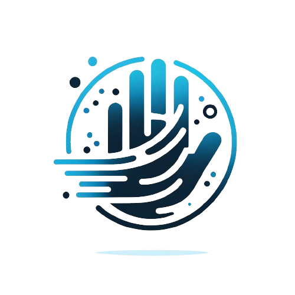

# GR Recognition System 
  
  

  
Welcome to the Gesture Recognition Web Application repository. This project leverages cutting-edge computer vision and machine learning technologies to recognize hand gestures in real-time. Our tool is designed to be intuitive and interactive, providing users with a seamless experience as they explore gesture-based interfaces.

  <h2>Table of Contents</h2>
  <ol>
    <li><a href="#introduction">Introduction</a></li>
    <li><a href="#real-time-video-demonstration">Real-Time Video Demonstration</a></li>
    <li><a href="#how-to-use-the-code">How to Use the Code</a></li>
  </ol>

  <h2 id="introduction">Introduction</h2>

  

  
This project is a web-based application that utilizes the latest advancements in computer vision, deep learning, and sensor fusion to deliver accurate and flexible gesture recognition. Whether you're developing smart device interfaces or exploring new ways to interact with digital environments, our tool offers powerful performance and reliability.

  <h3>Key Features:</h3>
  <ul>
    <li><strong>Cutting-Edge Computer Vision:</strong> Leverages advanced techniques for precise gesture detection.</li>
    <li><strong>Real-Time Performance:</strong> Delivers fast response times and robust detection, even in complex environments.</li>
    <li><strong>Future of Interaction:</strong> Ideal for intuitive, hands-free control of smart devices and digital spaces.</li>
  </ul>

  <h2 id="real-time-video-demonstration">Real-Time Video Demonstration</h2>

  

  
Our gesture recognition tool processes video input in real-time, detecting and recognizing hand gestures with high accuracy. The tool can be accessed via the "Gesture Recognition" section of the web interface. Once you scroll to this section, the video feed will start automatically, showcasing the tool's capabilities.

  <h3>How to Access the Real-Time Video</h3>
  <ol>
    <li>Navigate to the "Gesture Recognition" section of the web interface.</li>
    <li>Scroll down until you see the video feed area.</li>
    <li>The video feed will start automatically, displaying the real-time gesture recognition results.</li>
  </ol>

  <h2 id="how-to-use-the-code">How to Use the Code</h2>

  
To run this project locally, follow these steps:

  <h3>Prerequisites</h3>
  <ul>
    <li>Python 3.7 or higher</li>
    <li>Flask</li>
    <li>OpenCV</li>
    <li>MediaPipe</li>
    <li>Joblib</li>
    <li>Numpy</li>
  </ul>

  <h3>Installation</h3>
  <ol>
    <li><strong>Clone the repository:</strong></li>
    <pre><code>git clone https://github.com/your-username/gesture-recognition-webapp.git
cd gesture-recognition-webapp
    </code></pre>
    <li><strong>Install the required dependencies:</strong></li>
    <pre><code>pip install -r requirements.txt</code></pre>
    <li><strong>Download and place the classifiers:</strong> Ensure you have the pre-trained gesture recognition classifiers (SVM, RF, MLP) in the specified paths within the code.</li>
  </ol>

  <h3>Running the Application</h3>
  <ol>
    <li><strong>Start the Flask application:</strong></li>
    <pre><code>python app.py</code></pre>
    <li><strong>Access the web application:</strong> Open your web browser and navigate to <code>http://localhost:8080</code>.</li>
    <li><strong>Navigate through the website:</strong></li>
    <ul>
      <li><strong>Home:</strong> Introduction and overview of the project.</li>
      <li><strong>Gesture Recognition:</strong> Real-time demonstration of the gesture recognition tool.</li>
      <li><strong>About:</strong> Information about the project and the technology used.</li>
      <li><strong>Contact:</strong> Contact information and links to social profiles.</li>
    </ul>
  </ol>

  <h3>Code Overview</h3>
  <ul>
    <li><strong>app.py:</strong> Main Flask application file that handles routes and video processing.</li>
    <li><strong>templates/index.html:</strong> HTML template for the web application.</li>
    <li><strong>static/css/main.css:</strong> CSS styles for the web application.</li>
    <li><strong>static/js/functions-min.js:</strong> JavaScript functions for interactivity.</li>
  </ul>

  <h3>Customizing the Application</h3>
  
You can modify the <code>app.py</code> and <code>index.html</code> files to adjust the behavior and appearance of the application according to your needs. The Flask app handles video feed routing, while the HTML and JavaScript manage the front-end interface and user interactions.

  
Feel free to explore the code, experiment with different models, and enhance the application to suit your specific requirements.

  

  
We hope you enjoy using our Gesture Recognition Web Application! If you have any questions or need further assistance, please don't hesitate to contact us or submit an issue on GitHub.

